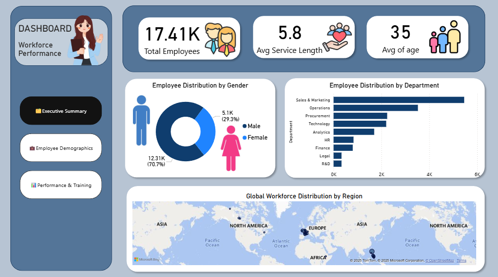
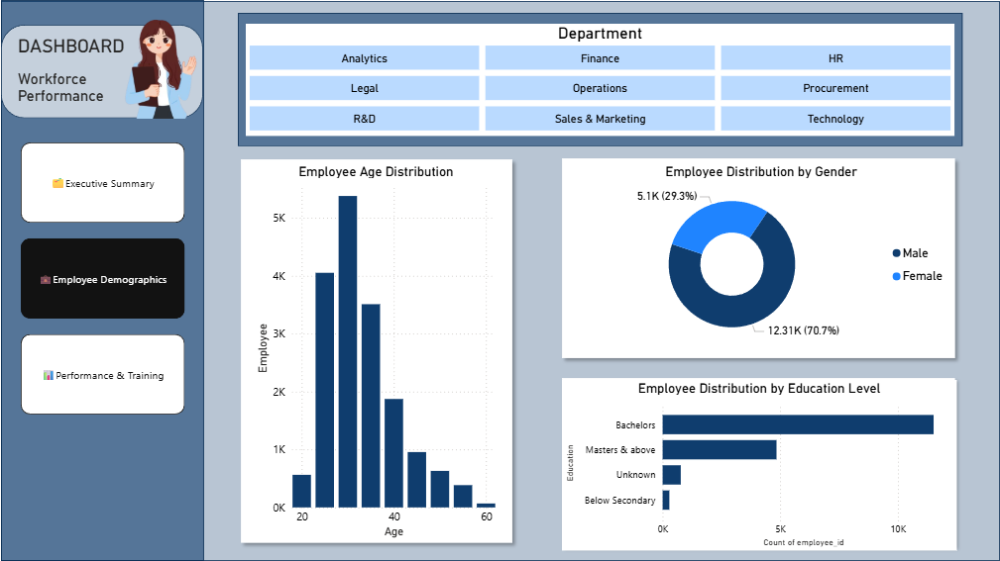

# Workforce Performance Dashboard  

## 📌 Project Overview  
This project analyzes workforce data to provide insights into employee demographics, performance, and training participation. The dashboard was built in **Power BI** to help HR leaders and managers make data-driven decisions.  

---

## 🔑 Key Features  
🗂️ **Executive Summary**: Total employees, average service length, average age, workforce distribution by gender, department, and region.  
💼 **Employee Demographics**: Filter by department, age distribution, gender, and education.  
📊 **Performance & Training**: Training participation vs KPI achievement, awards per department, training performance by age, KPI achievement rate.  

---
## 🖼️ Dashboard Preview  

### Executive Summary  

💡 Insight : The workforce is heavily male-dominated, and Sales & Marketing has the largest headcount, indicating a strong focus on revenue-driving functions.

### Employee Demographics  
  
💡 Insight: Most employees are aged 25–35 with 4–10 years of tenure, and the majority hold a bachelor’s degree. The workforce is young and experienced, though the limited number of senior experts suggests a need for knowledge transfer initiatives.

### Performance & Training  
  
💡 Insight: Employees who participate in training demonstrate higher KPI achievement, especially those under 30, proving that training has a positive impact on performance.

---

## ⚙️ Tools Used  
**Power BI** → Data cleaning (Power Query), dashboard development & data visualization  

---

## 🚀 How to Use  
1. Clone or download this repository.  
2. Open `Workforce_Performance_Dashboard.pbix` in **Power BI Desktop**.  
3. Use slicers and filters to explore the dashboard.  
